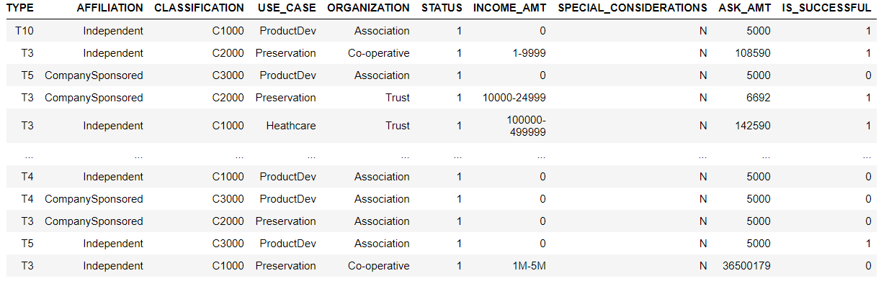

# Neural Network Charity Analysis

# Overview
- Using binary classification, our model attempts to predict whether a charity that receives funding will be successful. Input features include charity organizational structure, function and dollar amount of funding request.
- The target feature as seen in the image below is "IS_SUCCESSFUL"

# Results

- Our model proved to be ~72.5% accurate, meaning it would correctly predicted the success of of a charity about 72.5% of the time. This is fair considering the relatively small set of input features, but needs further optimization. 
- Model contains two hidden layers
- hidden layer activation function: ReLU
- output layer activation function: sigmoid 

# Summary
- Our first model, with results shown above, did not reach the target accuracy of 75%. In order to try and reach this threshold, I added a third hidden layer, and experimented with changing the number of neurons in each hidden layer, as well as the activation functions for the hidden layers. 
- These changes did not prove succesful, as I was not able to reach an accuracy over 75% 
