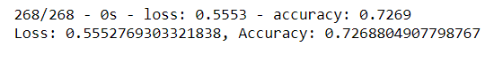

# Neural Network Charity Analysis

# Summary
Using binary classification, our model attempts to predict whether a charity that receives funding will be successful. Input features include charity organizational structure, function and dollar amount of funding request.

# Results

Our model proved to be ~72.5% accurate, meaning it would correctly predicted the success of of a charity about 72.5% of the time. This is fair considering the relatively small set of input features, but needs further optimization. 
